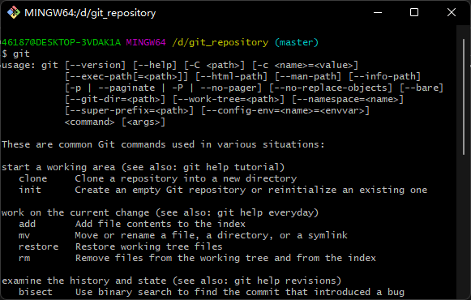

>Hexo + GitHub Pages 创建个人博客网站。

<!-- toc -->

# 一、工具介绍
本文利用了静态博客网站框架 Hexo 和开源托管平台github下的 GitHub Pages 来进行基本的静态博客搭建，并将网站部署在 GitHub Pages 上供免费使用。

## 1. hexo
Hexo 是一个快速、简洁且高效的博客框架。Hexo 使用 Markdown（或其他渲染引擎）解析文章，在几秒内，即可利用靓丽的主题生成静态网页。

## 2. GitHub pages
GitHub Pages 可以当作自己或者自己项目的网站，所以 GitHub Pages 有两种最近本的用法：

* 作为你自己（或组织）的网站（访问地址示例： http://username.github.io）
* 作为你某一个项目的网站（访问地址示例： username.github.io/pro....）

# 二、准备工作
接下来就进入搭建个人博客的具体步骤，首先我们需要做一些准备工作。

## 1. 关于 GitHub 账号
我们需要一个 GitHub 账号，没有的话请到 [官网](https://github.com/) 直接申请一个。注册很简单，在这里不做多于赘述。

## 2. 在本地安装 Git
* 下载

网址： https://git-scm.com/download/win  
根据自己的 windows 系统选择对应的 git 版本下载。得到安装包：**Git-2.35.1.2-64-bit.exe**

* 安装

双击安装包开始安装，一路点击 Next 即可，安装完成后鼠标右键会有 Git Bash Here 命令，这是 Git 的命令行，说明安装成功了。  

在 bash 命令行中输入如下命令，即可配置好 Git 用户名和邮箱地址（建议与Github保持一直）。

    git config --global user.name "Your Name"
    git config --global user.email "email@example.com"

其余 Git 命令我们将在下面用到时进行说明。

## 3. 安装 Node.JS

由于 Hexo 基于 Node.JS 编写的，所以需要安装 Node.JS 和 npm 工具。

* 下载

网址： https://nodejs.org/zh-cn/download/  
根据自己的 windows 系统选择对应的 git 版本下载。得到安装包： **node-v16.14.2-x64.msi**  

* 安装

双击安装包开始安装，一路点击 Next 即可（自行修改安装路径），安装完成后， msi 格式的安装包会自动添加环境变量。  

打开 CMD 命令窗口（或者在 Git Bash 下），执行命令 node -v 查看 node 版本。同时也执行 npm -v 查看 npm 版本。  

# 三、创建 GitHub 网站仓库

我们需要在 GitHub 上创建一个仓库，专门用于存放 Hexo 所生成的静态博客文件，并将其推至个人的 GitHub Pages 网站上。

登录 GitHub 官网后，依次点击 头像、下来菜单 your repositories 进入仓库页面。  

点击 New 新建一个崭新的仓库，进入仓库创建页面。在 Repository name 一栏填写仓库名，必须为 <用户名>.github.io，填写完后直接点击 Create repository 创建仓库。  

点击 creating a new file 创建一个新文件，作为我们网站的主页。新文件的名字必须为 index.html ，可随便写一点简单内容，示例如下，填写好之后点击 Commit new file 提交。

    <!DOCTYPE html>
    <html lang="en">
    <head>
        <meta charest="UTF-8">
        <title>Avalon1997</title>
    </head>
    <body>
        <h1>Avalon1997的个人主页</h1>
        <h1>Hello~~~</h1>
    </body>
    </html>

在仓库的 Settings 找到 Pages 选项，查看我们个人网站的主页为：https://avalon1997.github.io/  

浏览器中访问页面，打开成功即可。目前的网页及其的简陋，只做展示。

# 四、安装 Hexo

我们采用 Hexo 来创建我们的静态博客网站，使用 Hexo 不需要很大的开发，只进行一些必要的配置即可生成一个个性化的博客网站，非常的方便快捷。

使用 npm 安装 Hexo

    npm install -g hexo-cli

安装好后，查看当前版本

    hexo -v

创建一个项目(例如：MyBlog)并初始化

    hexo init MyBlog
    cd MyBlog
    npm install

本地启动项目测试

    hexo g
    hexo server

浏览器访问网址： http://localhost:4000 ，可查看初始页面风格，在此不配图展示。

# 五、更换主题

Hexo 默认的主题不太好看，喜欢默认主题的请略过此章，需要更换主题的请继续往下看。 
官方提供了数百种主题供用户选择，可以根据个人喜好更换，官网主题请点击 [这里](https://hexo.io/themes/) 查看。本章在这里只介绍个人使用主题 Fluid ，后续章节也是在 Fluid 主题基础上进行讲解。

* 安装 Fluid 主题

下载 [最新 release 版本](https://github.com/fluid-dev/hexo-theme-fluid/tags) 的 rar 压缩包解压到 themes 目录，并将解压出的文件夹重命名为 fluid。

* 指定 Fluid 主题

修改 MyBlog 博客目录下的 _config.yml 文件：

    language: zh-CN
    theme: fluid

* 创建 [关于页]

首次使用主题的 [关于页] 需要手动创建：

    hexo new page about 

创建成功后，编辑博客目录下的 /source/about/index.md ，添加 layout 属性。  
修改后的示例文件如下：

    ---
    title: about
    date: 2022-03-23 18:25:33
    layout: about
    ---

    请在这里写关于页的正文，支持 Markdown、HTML

本地启动测试

    hexo g -d
    hexo s

浏览器访问网址： http://localhost:4000 ，fluid 主题风格如下：  

