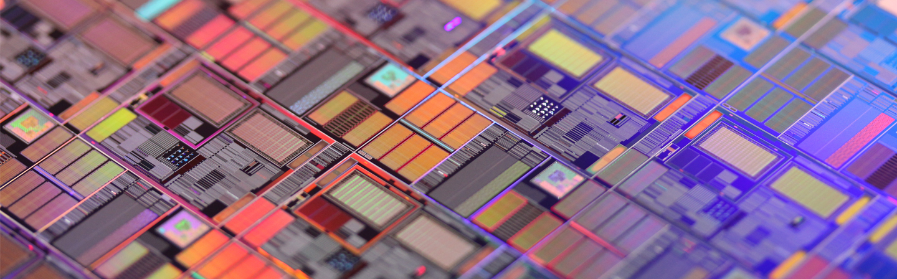

>本文将从集成电路开始讲起，介绍芯片以及STM32的发展史，便于读者更易于学习STM32。

# 什么是集成电路？

## 定义
集成电路是一种微型的电子器件（或部件）。在电子学中是一种将电路（主要包括半导体设备，也包括被动组件等）集中制造在半导体晶圆表面上的小型化方式。前述将电路制造在半导体芯片表面上的集成电路，又称薄膜集成电路。另有一种厚膜集成电路是由独立半导体设备和被动组件集成到衬底或线路板所构成的小型化电路。  

    
    
    


## 发明者

它在电路中用字母 IC 表示。从1949年到1957年，维尔纳·雅各比、杰佛理·杜莫、西德里·达林顿、樽井康夫都发明出了原型。现代的集成电路则是由杰克·基尔比在1958年发明，并因此荣获了2000年诺贝尔物理奖。但同一时间发明出近代实用的集成电路的罗伯特·诺伊斯，却早在1990年就过世，享年62岁。  

    
    


## 优缺

最先进的集成电路是微处理器或多核处理器的核心，可以控制一切电路，从微波炉、手机到电脑;存储器和特定应用集成电路是其他集成电路家族的例子，对于现代信息社会非常重要。虽然设计开发一个复杂集成电路的成本非常高，但是当成本分散到数以百万计的产品上时，每个集成电路的成本便能最小化。集成电路的性能很高，因为小尺寸带来短路径，使得低功耗逻辑电路可以在快速开关场景下应用。  
这些年来，集成电路持续向更小的外型尺寸发展，使得每个芯片可以封装更多的电路。增加了每单位面积容量，可以降低成本和增加功能，由著名的摩尔定律得知，集成电路中的晶体管数量，每1.5年增加一倍。总之，随着外形尺寸缩小，几乎所有的指标改善了：单位成本和开关功率消耗下降，速度提高。但是，集成纳米级别设备的IC并不是完美的，最明显的问题是泄漏电流。因此，对于最终用户的速度和功率消耗增加非常明显，制造商面临使用更好几何学的尖锐挑战。这个过程和在未来几年所期望的进步，在半导体国际技术路线图中有很好的描述。  

    
    


# 什么是中央处理器（CPU）？

中央处理器（Central Processing Uint, CPU）是计算机的主要设备之一。其广义上指一系列可以执行复杂的计算机程序的逻辑机器。这个空泛的定义很容易地将在 CPU 这个名称被普遍使用之前的早期计算机也包括在内。而无论如何，至少从 1960s 早期开始，这个名称及其缩写已开始在电子计算机产业中得到广泛应用。虽然与早期相比，中央处理器在物理形态、设计制造和具体任务的执行上有了极大的发展，但是其基本的操作原理和逻辑一直没有改变。  

## 功能

其功能是解释计算机指令以及处理计算机软件中的数据，负责读取指令，对指令译码并执行指令。计算机的可编程性主要是指对中央处理器的编程。

## 结构

1970s 以前，中央处理器由多个独立单元构成，后来发展出由集成电路制造的中央处理器，这些高度收缩的器件就是所谓的微处理器，其中分出的中央处理器最为复杂的电路可以做成单一微小功能强大的单元，也就是所谓的核心。  

## 性能

CPU 的性能和速度取决于时钟频率（hz/Ghz）和每周期可处理的指令（IPC），两者结合起来就是每秒可处理的指令（IPS）。IPS 的值代表了 CPU 在集中人工指令序列下高峰期的执行率、指示和应用。而现实中 CPU 组成了混合指令和应用，可能需要用更长的时间来完成 IPS 显示的值。并且其内存层次结构的性能也会大大影响中央处理器的性能。通常工程师便用各种已标准化的测试去测试 CPU 的性能，已标准化的测试通常被称为 “基准” 。 如 SPECint，此软件试图模拟现实中的环境来测量各个常用的应用程序，来得出现实中 CPU 的性能评价。

同时，多核心处理器也是提高处理性能的关键。原理基本上是一个集成电路插入两个以上的个别处理器。在理想的情况下，双核心处理器性能将是宏内核处理器的两倍。然而，在现实中因不完善的软件算法，多核心处理器性能的增益远远低于理论值，增益只有1.5倍左右。但增加核心数量的处理器，依然可以增加一台计算机可以处理的工作量。这意味着该处理器可以处理大量的不同步的指令和事件，可分担第一核心不堪重负的工作。有时，第二核心将和相邻核心同时处理相同的任务，以防单核心崩溃问题的出现。

# 什么是 Intel 架构和 ARM 架构？

## 芯片架构是什么？

芯片架构有两个含义： **微架构** 和 **指令集架构**** 。在这里我们讨论的是 **指令集架构** 。  
指令集架构（Instruction Set Architecture, ISA）又称为指令集或者指令集体系，是计算机体系结构中与程序设计有关的部分，包含了基本数据类型、指令集、寄存器、寻址模式、存储体系、中断、异常处理以及外部I/O。指令集架构包含一系列的 opcode 即操作码（机器语言），以及由特定处理器执行的基本命令。

不同的处理器“家族”——例如 Intel IA-32 和 x86-64 、IBM/Freescale Power 和 ARM 处理器家族——有着不同的指令集架构。

指令集架构与微架构（一套用于执行指令集的微处理器设计方法）不同。使用不同的微架构的电脑可以共享同一种指令集。例如， Intel 的 Pentium 和 AMD 的 AMD Athlon ，两者几乎采用相同版本的x86指令集体系，但是两者在内部硬件设计上有着本质的区别。

我们在这里讨论一下64位的 Intel 的架构和 ARM 架构。

## 对于 Intel x86-64

其实，Intel 并没有开发64位版本的 x86 指令集。这个64位的指令集，名为 x86-64 （有时简称为64），实际上是 AMD 设计开发的。故事是这样的： Intel 想要做64位计算，但如果从自己的32位x86架构进化出64位架构，效率会非常的低，于是它成立了一个新64位处理器项目——IA64，由此制造出了 Itanium 系列处理器。同时，AMD 知道自己造不出能与IA64兼容的处理器，于是它把x86扩展了一下，加入了64位寻址和64位寄存器。最终出来的架构，称为 AMD64 ，成为了64位版本的x86处理器的标准。IA64项目并不算得上成功，现如今已经基本被放弃了。最终 Intel 采用了 AMD64 。Intel 当前给出的移动方案，是采用了AMD开发的64位指令集的基础上有一些小改动的64位处理器。

## 对于 ARM64
ARM 的故事和 Intel 完全不一样：它看到移动设备对64位计算的需求后，ARM于2011年发布了 ARMv8 64 位架构，这是为了下一代 ARM 指令集架构工作若干年后的结晶。为了基于原有的原则和指令集，开发一个简明的64位架构，ARMv8 使用了两种执行模式， AArch32 和 AArch64。顾名思义，一个运行32位代码，另一个运行64位代码。ARM 设计的巧妙之处在于处理器运行中可以无缝的在两种模式间切换。这意味着64位指令的解码器是全新设计的，不用兼顾32位指令，而处理器依然可以向后兼容。

# 什么是单片机？

# 什么是 STM32 ？
