>本文将从集成电路开始讲起，介绍芯片以及STM32的发展史，便于读者更易于学习STM32。

# 什么是集成电路？

## 定义
**集成电路** 是一种微型的电子器件（或部件）。在电子学中是一种将电路（主要包括半导体设备，也包括被动组件等）集中制造在半导体晶圆表面上的小型化方式。前述将电路制造在半导体芯片表面上的集成电路，又称 **薄膜集成电路**。另有一种厚膜集成电路是由独立半导体设备和被动组件集成到衬底或线路板所构成的小型化电路。  

    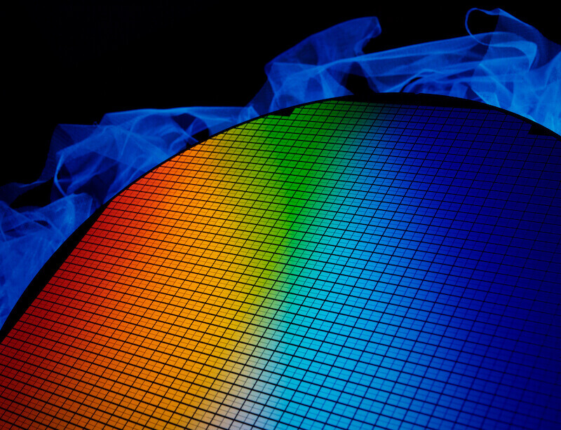
    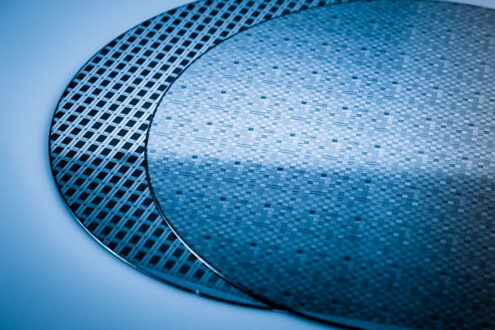
    


## 发明者

它在电路中用字母 IC 表示。从1949年到1957年，维尔纳·雅各比、杰佛理·杜莫、西德里·达林顿、樽井康夫都发明出了原型。现代的集成电路则是由 杰克·基尔比 在1958年发明，并因此荣获了2000年诺贝尔物理奖。但同一时间发明出近代实用的集成电路的 罗伯特·诺伊斯 ，却早在1990年就过世，享年62岁。  

    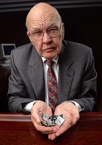
    


## 优缺

最先进的集成电路是 **微处理器** 或 **多核处理器的核心** ，可以控制一切电路，从微波炉、手机到电脑;存储器和特定应用集成电路是其他集成电路家族的例子，对于现代信息社会非常重要。虽然设计开发一个复杂集成电路的成本非常高，但是当成本分散到数以百万计的产品上时，每个集成电路的成本便能最小化。集成电路的性能很高，因为小尺寸带来短路径，使得低功耗逻辑电路可以在快速开关场景下应用。  
这些年来，集成电路持续向更小的外型尺寸发展，使得每个芯片可以封装更多的电路。增加了每单位面积容量，可以降低成本和增加功能，由著名的摩尔定律得知，集成电路中的晶体管数量，每1.5年增加一倍。总之，随着外形尺寸缩小，几乎所有的指标改善了：单位成本和开关功率消耗下降，速度提高。但是，集成纳米级别设备的IC并不是完美的，最明显的问题是泄漏电流。因此，对于最终用户的速度和功率消耗增加非常明显，制造商面临使用更好几何学的尖锐挑战。这个过程和在未来几年所期望的进步，在半导体国际技术路线图中有很好的描述。  

    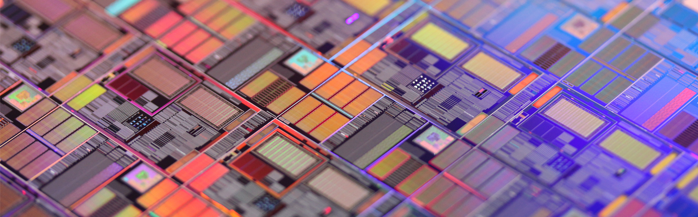
    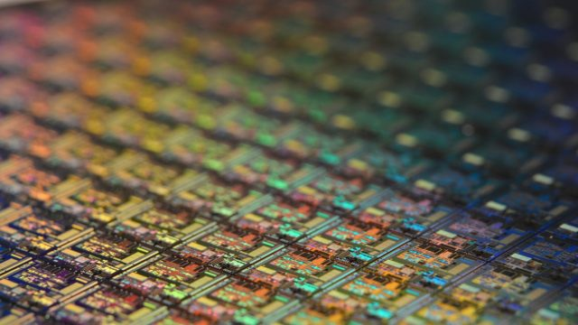


# 什么是中央处理器（CPU）？

**中央处理器** （Central Processing Uint, CPU）是计算机的主要设备之一。其广义上指一系列可以执行复杂的计算机程序的逻辑机器。这个空泛的定义很容易地将在 CPU 这个名称被普遍使用之前的早期计算机也包括在内。而无论如何，至少从 1960s 早期开始，这个名称及其缩写已开始在电子计算机产业中得到广泛应用。虽然与早期相比，中央处理器在物理形态、设计制造和具体任务的执行上有了极大的发展，但是其基本的操作原理和逻辑一直没有改变。  
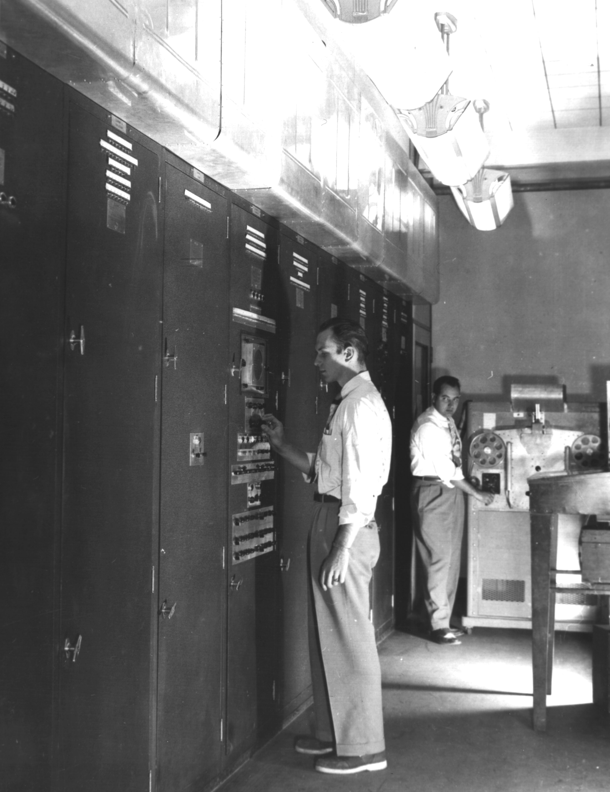

## 功能

其功能是解释计算机指令以及处理计算机软件中的数据，负责读取指令，对指令译码并执行指令。计算机的可编程性主要是指对中央处理器的编程。

## 结构

1970s 以前，中央处理器由多个独立单元构成，后来发展出由集成电路制造的中央处理器，这些高度收缩的器件就是所谓的微处理器，其中分出的中央处理器最为复杂的电路可以做成单一微小功能强大的单元，也就是所谓的核心。  
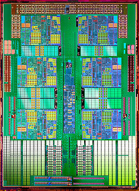

## 性能

CPU 的性能和速度取决于时钟频率（hz/Ghz）和每周期可处理的指令（IPC），两者结合起来就是每秒可处理的指令（IPS）。IPS 的值代表了 CPU 在集中人工指令序列下高峰期的执行率、指示和应用。而现实中 CPU 组成了混合指令和应用，可能需要用更长的时间来完成 IPS 显示的值。并且其内存层次结构的性能也会大大影响中央处理器的性能。通常工程师便用各种已标准化的测试去测试 CPU 的性能，已标准化的测试通常被称为 “基准” 。 如 SPECint，此软件试图模拟现实中的环境来测量各个常用的应用程序，来得出现实中 CPU 的性能评价。

同时，多核心处理器也是提高处理性能的关键。原理基本上是一个集成电路插入两个以上的个别处理器。在理想的情况下，双核心处理器性能将是宏内核处理器的两倍。然而，在现实中因不完善的软件算法，多核心处理器性能的增益远远低于理论值，增益只有1.5倍左右。但增加核心数量的处理器，依然可以增加一台计算机可以处理的工作量。这意味着该处理器可以处理大量的不同步的指令和事件，可分担第一核心不堪重负的工作。有时，第二核心将和相邻核心同时处理相同的任务，以防单核心崩溃问题的出现。

# 什么是 Intel 架构和 ARM 架构？

## 芯片架构是什么？

芯片架构有两个含义： **微架构** 和 **指令集架构**** 。在这里我们讨论的是 **指令集架构** 。  
指令集架构（Instruction Set Architecture, ISA）又称为指令集或者指令集体系，是计算机体系结构中与程序设计有关的部分，包含了基本数据类型、指令集、寄存器、寻址模式、存储体系、中断、异常处理以及外部I/O。指令集架构包含一系列的 opcode 即操作码（机器语言），以及由特定处理器执行的基本命令。

不同的处理器“家族”——例如 Intel IA-32 和 x86-64 、IBM/Freescale Power 和 ARM 处理器家族——有着不同的指令集架构。

**指令集架构** 与 **微架构** （一套用于执行指令集的微处理器设计方法）不同。使用不同的微架构的电脑可以共享同一种指令集。例如， Intel 的 Pentium 和 AMD 的 AMD Athlon ，两者几乎采用相同版本的x86指令集体系，但是两者在内部硬件设计上有着本质的区别。

我们在这里讨论一下64位的 Intel 的架构和 ARM 架构。

## 对于 Intel x86-64

其实，Intel 并没有开发64位版本的 x86 指令集。这个64位的指令集，名为 x86-64 （有时简称为64），实际上是 AMD 设计开发的。故事是这样的： Intel 想要做64位计算，但如果从自己的32位x86架构进化出64位架构，效率会非常的低，于是它成立了一个新64位处理器项目——IA64，由此制造出了 Itanium 系列处理器。同时，AMD 知道自己造不出能与IA64兼容的处理器，于是它把x86扩展了一下，加入了64位寻址和64位寄存器。最终出来的架构，称为 AMD64 ，成为了64位版本的x86处理器的标准。IA64项目并不算得上成功，现如今已经基本被放弃了。最终 Intel 采用了 AMD64 。Intel 当前给出的移动方案，是采用了AMD开发的64位指令集的基础上有一些小改动的64位处理器。

## 对于 ARM64
ARM 的故事和 Intel 完全不一样：它看到移动设备对64位计算的需求后，ARM于2011年发布了 ARMv8 64 位架构，这是为了下一代 ARM 指令集架构工作若干年后的结晶。为了基于原有的原则和指令集，开发一个简明的64位架构，ARMv8 使用了两种执行模式， AArch32 和 AArch64。顾名思义，一个运行32位代码，另一个运行64位代码。ARM 设计的巧妙之处在于处理器运行中可以无缝的在两种模式间切换。这意味着64位指令的解码器是全新设计的，不用兼顾32位指令，而处理器依然可以向后兼容。

# 什么是单片机？

 **单片机** ，全称 **单片微型计算机** （英语：single-chip microcomputer），又称 **微控制器单元** （microcontroller unit），是把中央处理器、存储器、定时/计数器（timer/counter）、各种输入输出接口等都集成在一块集成电路芯片上的微型计算机。  
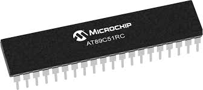

 与应用在个人电脑中的通用型微处理器相比，它更强调自供应（不用外接硬件）和节约成本。它的最大优点是体积小，可放在仪表内部，但存储量小，输入输出接口简单，功能较低。由于其发展非常迅速，旧的定义已不能满足，所以在很多应用场合被称为范围更广的微控制器；由于单片机微电脑常用于当控制器故又名 single chip microcontroller。翻译过来称 **单片机** ，英文缩写为 MCU 。

## 单片机的结构

绝大多数现在的单片机都是基于 **冯·诺伊曼** 结构的，这种结构清楚地定义了嵌入式系统所必需的四个基本部分：一个 **中央处理器核心** ， **程序存储器** （只读存储器或者闪存）、 **数据存储器** （随机存储器）、一个或者更多的 **定时/计数器** ，还有用来与外围设备以及扩展资源进行通信的输入/输出端口——所有这些都被集成在单个集成电路芯片上。  
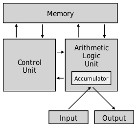

单片机与通用型中央处理单元芯片不同在于前者一般很容易配合最小型的外部支持芯片制成工作计算机。这样就可以很容易的把单片机系统植入其他硬件设备内部来控制设备。近年来为了在指令和数据上使用不同的字宽，并提高处理器线速度，哈佛结构在微控制器（Microcontrollers）和数字信号处理器也逐渐得到了广泛的应用。

传统上的 **微处理器** 无法通过单一本体实现单片机的工作，它必须连接一些其他芯片和外设。例如，因为芯片上没有数据存储器，就必须添加一些RAM的存储芯片，虽然添加内存的容量很灵活，但无内存便无法工作；另外还需要连线排线等来传递芯片之间的数据。而相反的，单片机的工作则相对独立，只需要内部集成 **时钟触发器** （CLK）和很少的 RAM、ROM 就可以在软件和晶振下工作了。同时，单片机具有丰富的输入输出设备，例如典型的 ADC 模数转换器、 Timer 定时器、 USART 串口，一级其他串行通信接口等。通常这些集成在内部的外设可以通过特殊的指令来操作。

**单片机** 时钟频率通常较同时代的计算机芯片低，但它价格低廉，能够提供充足的程序存储器、丰富的片上接口。某些架构的单片机生产厂商众多，例如8051系列、Z80系列。一些现代的微控制器支持一些内建的高级编程语言，比如BASIC语言、C语言、C++等。  

    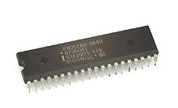
    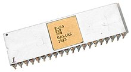


## 单片机的位数

根据总线或寄存器的宽度， **单片机** 分为4位、8位、16位和32位单片机。4位单片机多用于冰箱、洗衣机、微波炉等家电控制中；8位、16位单片机主要用于一般的控制领域，一般不使用操作系统；32位用于网络操作、多媒体处理等复杂处理的场合，一般配合使用 **嵌入式操作系统** 。

## 单片机的开发

单片机的软件开发中，以往多使用汇编语言，如今越来越多的使用C语言，又或者使用BASIC语言等更适合初学者的语言，部分集成开发环境支持C++。单片机的软件测试需要使用 **单片机开发器** 或 **模拟器** 。

随着技术的发展，2000年后已经有很多单片机自带了ISP（在线编程设计）或支持IAP，彻底地改变了传统的开发模式，使得开发单片机系统时不会损坏芯片的引脚，加速了产品的上市并降低了研发成本，缩短了从设计、制造到现场调试的时间，简化了生产流程，大大提高了工作效率。这类单片机包括AT89S系列单片机、AVR系列单片机等。

# 什么是 STM32 ？

STM32 是由意法半导体基于 **ARM Cortex-M** 研制和生产的一系列 32 位单片机。现在， STM32 的年出货量大约10亿片，成为 MCU 市场上举足轻重的品牌。  

2019年，在亚太区的 MCU 市场中，ST 超越 NXP 成为该地区 MCU 市场占有率第一的半导体厂商。
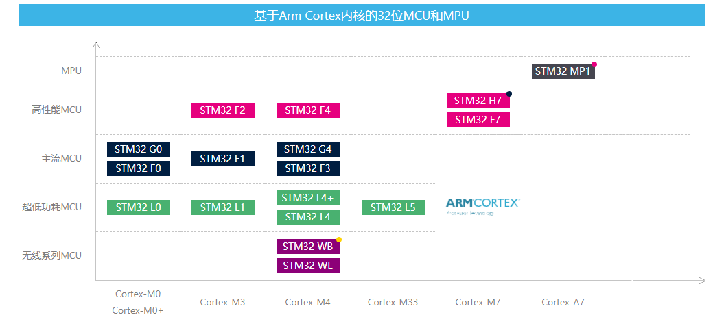

## 诞生

07年6月份首次产品发布于北京。**STM32F1** 诞生，这是业界首款搭载 **ARM Cortex-M3** 内核的32位 MCU，采用180nm闪存工艺，配有 128K 闪存 和 20KB RAM ，运行主频为72MHz，在当时属于相当高的配置。并且历史证明，这是一款成功的产品，它不仅为 STM32 家族开辟了一条康庄大道，自身也成为了一款长盛不衰的产品，至今仍是中国工程师的首选。  
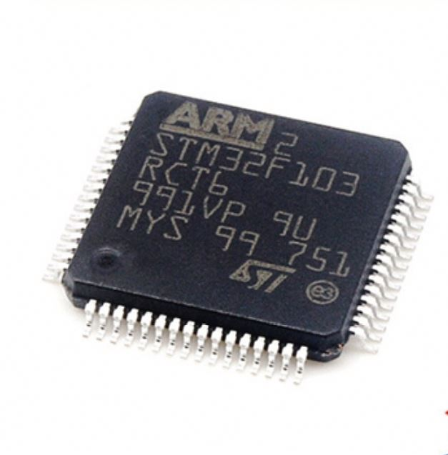

## 发展

在随后的十年内， STM32 产品相继加入了基于 **ARM Cortex-M0** 、 **Cortex-M4** 和 **Cortex-M7** 的产品，产品线覆盖通用型、低成本、超低功耗、高性能低功耗甚至高性能类型。搭载 **ARM Cortex-M4** 内核的 STML4 系列产品成为了另一款明星产品，它符合物联网时代的市场需求：强大的功能和较低的功耗。

## 特点

* **超低的价格：** 以8位 MCU 的价格，得到32位的 MCU，是 STM32 最大的优势。  
* **超多的外设：** STM32 拥有包括 FSMC、TIMER、SPI、IIC、USB、CAN、IIS、SDIO、ADC、DAC、RTC、DMA 等众多外设及功能，具有极高的集成度。  
* **丰富的型号：** STM32 仅 Cortex-M3 内核就拥有 F100、F101、F102、F103、F105、F107、F207、F217 等 8 个系列上百种型号，具有 QFN、LQFP、BGA 等封装可供选择。同时 STM32 还推出了 STM32L 和 STM32W 等超低功耗和无线应用型的 M3 芯片。  
* **优异的实时性能：** 84个中断，16 级可编程优先级，并且所有的引脚都可以作为中断输入。  
* **杰出的功耗控制：** STM32 各个外设都有自己的独立时钟开关，可以通过关闭相应外设的时钟来降低功耗。
* **较低的开发成本：** STM32 的开发不需要昂贵的仿真器，只需要一个串口即可下载代码，并且支持 SWD 和 JTAG 两种调试口。SWD 调试可以为你的设计带来跟多的方便，只需要两个 IO 口，即可实现仿真调试。  
* **超长的供货周期：** ST 采用供货长周期计划，MCU、MEMS 等产品具有十年供货承诺，而且是十年滚动续期供货承诺。  
* **成熟的生态系统：** ST 与合作伙伴共同构建了一个强大且成熟的 STM32 生态系统，提供完善的开发工具和技术支持，有助于简化产品的开发。  
* **完善的开发工具：** 硬件方面，ST 为各个系列提供了评估开发板。软件方面，开发者不仅可以使用传统 IDE（包括 Keil 和 IAR），还可以使用一整套免费的 STM32Cube 软件工具和扩展包，轻松解决软件开发方案。

## 应用场景

STM32 作为通用 MCU ，市场面对的客户不仅是消费类，更多的是工业控制，通信类客户。在数据采集、电机控制、人机交互、网络连接、 USB 通信等方面具有优势。常见的应用场景有：智能制造、医疗保健、智能家居、消费电子、可穿戴设备等等。

随着 STM32 产品的不断丰富，提供更高性能、更安全、更易于连接的 MCU 产品，未来在物联网领域的应用也将不断丰富。

---
**
学路漫漫其修远兮,吾将上下而求索
**