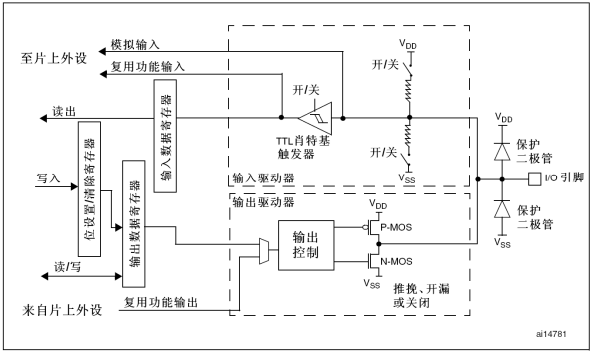
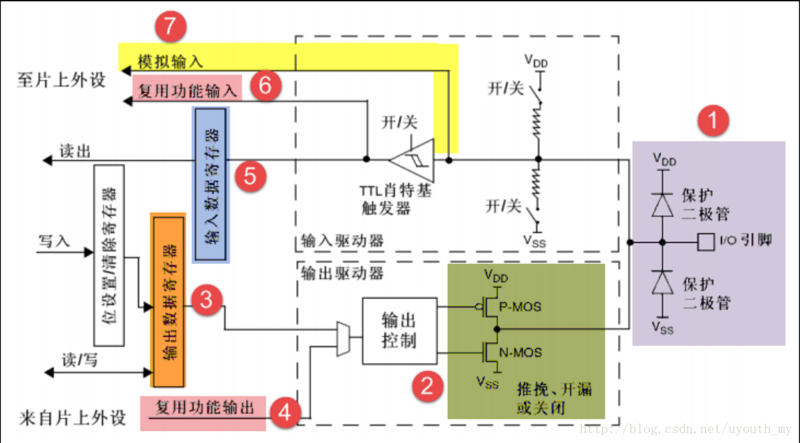
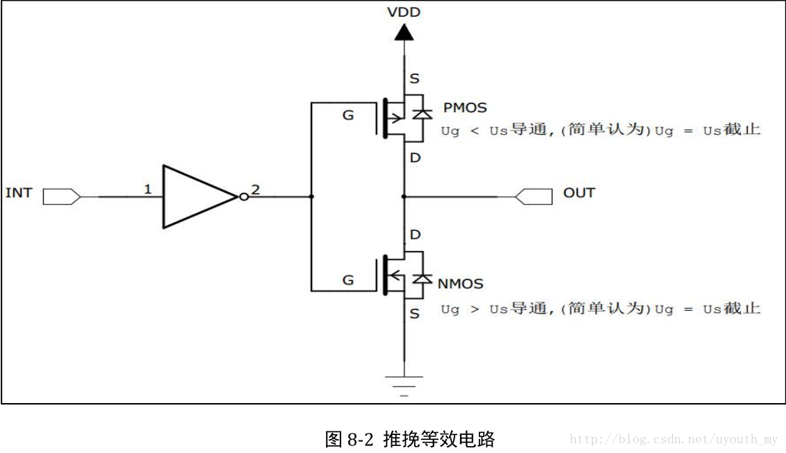
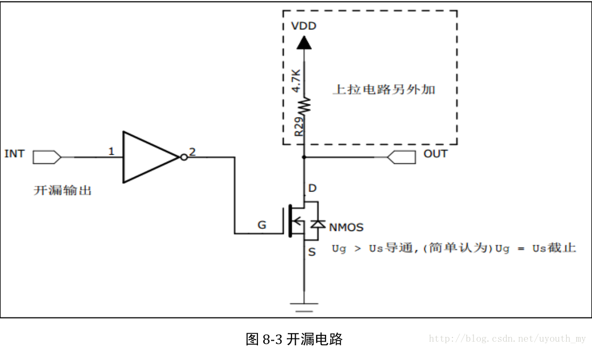
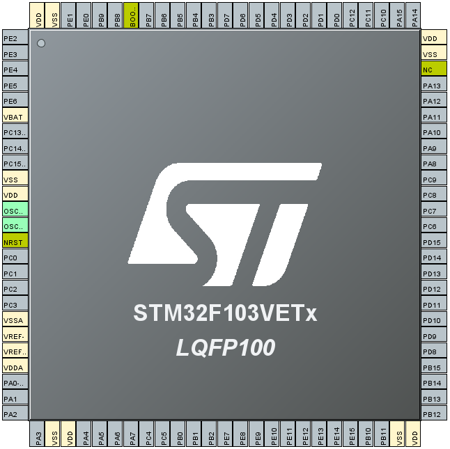

> 本片介绍 STM32F103VET6 通用 GPIO 的基本原理，功能及复用。

# 功能描述

每个 GPI/O 端口有两个32位配置寄存器(GPIOx_CRL，GPIOx_CRH)，两个32位数据寄存器(GPIOx_IDR和GPIOx_ODR)，一个32位置位/复位寄存器(GPIOx_BSRR)，一个16位复位寄存器(GPIOx_BRR)和一个32位锁定寄存器(GPIOx_LCKR)。  
在技术手册中列出了每个 I/O 端口的特定硬件特征， GPIO 端口的每个位可以由软件分别配置成多种模式：

+ 输入浮空  
+ 输入上拉  
+ 输入下拉  
+ 模拟输入  
+ 开漏输出  
+ 推挽式输出  
+ 推挽式复用功能
+ 开漏复用功能

每个 I/O 端口位可以自由编程，然而 I/O 端口寄存器必须按 32 位字被访问（不允许半字或字节访问）。 GPIOx_BSRR 和 GPIOx_BRR 寄存器允许对任何 GPIO 寄存器的读/更改的独立访问，在读和更改访问之间产生 IRQ(Interrupt Request) 不会有任何风险。

.png)

## 对于 GPIO 口的模式可精分为

### 输入模式（模拟/浮空/上拉/下拉）：

在输入模式时，施密特触发器打开，输出被禁止，可通过输入数据寄存器 GPIOx_IDR读取 I/O 状态。其中输入模式，可设置为上拉、下拉、浮空和模拟输入四种。上拉和下拉输入很好理解，默认的电平由上拉或者下拉决定。浮空输入的电平是不确定的，完全由外部的输入决定，一般接按键的时候用的是浮空输入。模拟输入则用于 ADC 采集。
### 输出模式（推挽/开漏）：

在输出模式中，推挽模式时双 MOS 管以轮流方式工作，输出数据寄存器GPIOx_ODR可控制 I/O 输出高低电平。开漏模式时，只有 N-MOS 管工作，输出数据寄存器可控制I/O输出高阻态或低电平。输出速度可配置，有 2MHz\10MHz\50MHz 的选项。此处的输出速度即 I/O 支持的高低电平状态最高切换频率，支持的频率越高，功耗越大，如果功耗要求不严格，把速度设置成最大即可。  
在输出模式时施密特触发器是打开的，即输入可用，通过输入数据寄存器 GPIOx_IDR可读取 I/O 的实际状态。
### 复用功能（推挽/开漏）：

复用功能模式中，输出使能，输出速度可配置，可工作在开漏及推挽模式，但是输出信号源于其它外设，输出数据寄存器 GPIOx_ODR 无效；输入可用，通过输入数据寄存器可获取 I/O 实际状态，但一般直接用外设的寄存器来获取该数据信号。

## GPIO 口结构框图分析

### ①保护二极管工作方式：

当引脚电压高于VDD时，上方的二极管导通，当引脚电压低于VSS 时，下方的二极管导通，防止不正常电压引入芯片导致芯片烧毁。所以引脚的两个保护二极管可以防止引脚外部过高或过低的电压输入。
### ②P-MOS 管和 N-MOS 管：

当输入的是高电平时，经过反向后，上方的 P-MOS 导通，下方的 N-MOS 关闭，对外输出高电平；而当该结构中输入低电平时，经过反向后，N-MOS 管导通，P-MOS 关闭，对外输出低电平。当引脚高低电平切换时，两个管子轮流导通，P 管负责灌电流，N 管负责拉电流，使其负载能力和开关速度都比普通的方式有很大的提高。这种工作方式就是所谓的推挽输出模式。推完等效电路如下图所示。

当工作在开漏输出模式时，上方的P-MOS 管完全不工作。当IO口输入低电平(0)时，经过反向，N-MOS 管导通，使输出接地；若当IO口输入1(无法直接输出为高电平)时，则 P-MOS 管和 N-MOS 管都关闭，所以引脚既不输出高电平，也不输出低电平，为高阻态。为正常使用时必须外部接上拉电阻。开漏等效电路如下图所示。

**注：**   
**推挽输出模式**一般应用在输出电平为 0 和 3.3 伏而且需要高速切换开关状态的场合。在 STM32 的应用中，除了必须用开漏模式的场合，我们都习惯使用推挽输出模式。  
**开漏输出模式**一般应用在 I2C、SMBUS 通讯等需要 **线与** 功能的总线电路中。除此之外，还用在电平不匹配的场合，如需要输出 5 伏的高电平，就可以在外部接一个上拉电阻，上拉电源为 5 伏，并且把 GPIO 设置为开漏模式，当输出高阻态时，由上拉电阻和电源向外输出 5 伏的电平。

### ③输出数据寄存器：

前面提到的双 MOS 管结构电路的输入信号，是由 GPIO **输出数据寄存器GPIOx_ODR** 提供的，因此我们通过修改输出数据寄存器的值就可以修改 GPIO 引脚的输出电平。而 **置位/复位寄存器GPIOx_BSRR** 可以通过修改输出数据寄存器的值从而影响电路的输出。

### ④复用功能输出：

**复用** 是指 STM32 的其它片上外设对 GPIO 引脚进行控制，此时 GPIO 引脚用作该外设功能的一部分，算是第二用途。从其它外设引出来的 **复用功能输出信号** 与 GPIO 本身的数据据寄存器都连接到双 MOS 管结构的输入中，通过图中的梯形结构作为开关切换选择。

### ⑤输入数据寄存器：

看 GPIO 结构框图的上半部分， GPIO 引脚经过内部的上、下拉电阻，可以配置成上/下拉输入，然后再连接到施密特触发器，信号经过触发器后，模拟信号转化为0、1的数字信号，然后存储在 **输入数据寄存器GPIOx_IDR** 中，通过读取该寄存器就可以了解 GPIO 引脚的电平状态。

### ⑥复用功能输入：

与 **复用功能输出** 模式类似，在 **复用功能输入模式** 时，GPIO 引脚的信号传输到 STM32 其它片上外设，由该外设读取引脚状态。同样，如我们使用 USART 串口通讯时，需要用到某个 GPIO 引脚作为通讯接收引脚，这个时候就可以把该 GPIO 引脚配置成 USART 串口复用功能，使 USART 可以通过该通讯引脚的接收远端数据。

### ⑦模拟输入输出：

当 GPIO 引脚用于 ADC 采集电压的输入通道时，用作 **模拟输入** 功能，此时信号是不经过施密特触发器的，因为经过施密特触发器后信号只有 0、1 两种状态，所以 ADC 外设要采集到原始的模拟信号，信号源输入必须在施密特触发器之前。类似地，当 GPIO 引脚用于 DAC 作为模拟电压输出通道时，此时作为 **模拟输出** 功能，DAC 的模拟信号输出就不经过双 MOS 管结构，模拟信号直接输出到引脚。

# STM32F103VET6_GPIO

---
**
学路漫漫其修远兮,吾将上下而求索
**

