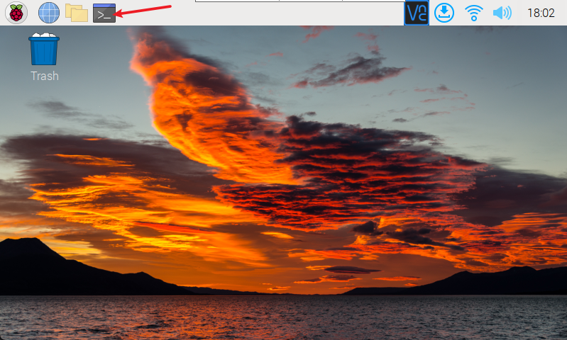
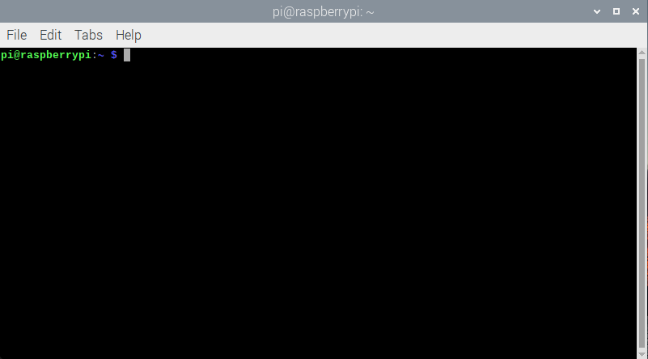
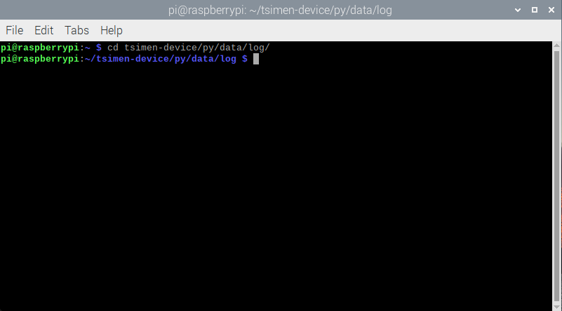
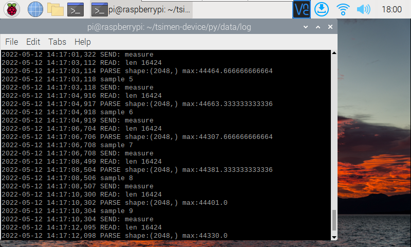
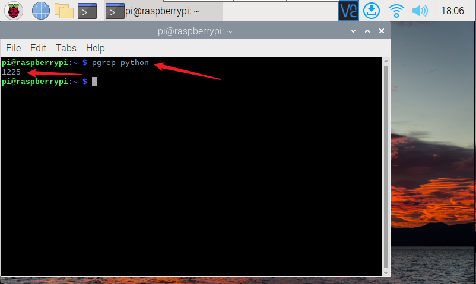
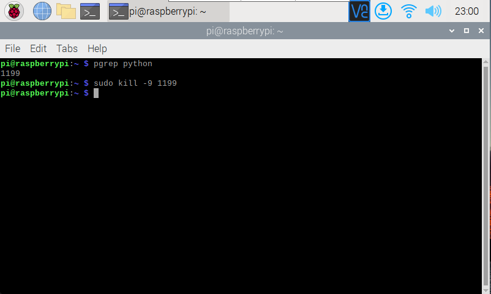
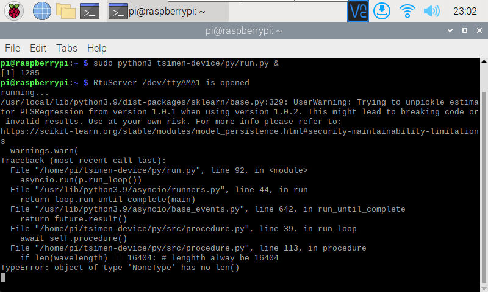

>此文章仅用于 Tsimen1.0 查看系统运行状态，下载数据使用。

**
说明： 目前Tsimen数据存放文件夹为
**

    #最新版本数据存放路径
    home/pi/tsimen-device/py/data

    #宁江设备数据存放路径
    home/pi/.tsimen-device/py/data

# 
查看计蒙运行状态

-----

1. 点亮树莓派屏幕。

2. 点击菜单栏终端按钮，打开命令行终端。

3. 在弹出的终端窗口中输入：

        #进入日志文件夹
        cd tsimen-device/py/data/log

        #宁江设备请使用如下指令进入日志文件夹
        cd .tsimen-device/py/data/log

4. 检查**当前路径**（蓝色字段即为当前路径）无误后，输入：

        #查看日志文件夹下所有内容
        ls

5. 记住最新日期的日志文件，输入：

        #实时查看最新的日志文件
        tail -f 日志文件名

# 
查看上位机（数采仪）程序运行状态

-----

在终端窗口中输入 pgrep python ,如果程序正常运行将显示一串随机整数

        pgrep python

        #显示内容为数字

# 
关闭/开启上位机（数采仪）程序

-----

* 关闭：查看到上位机程序状态后，记住显示的整数串，输入如下指令强制关闭程序：

        sudo kill -9 1225
        #1225 为对应现实的整数串

* 开启：输入如下指令开启程序

        sudo python3 tsimen-device/py/run.py &

