>此文章仅用于 Tsimen1.0 查看系统运行状态、下载数据、接线、查看指示灯等使用。

**
说明： 目前Tsimen数据存放文件夹为
**

    #最新版本数据存放路径
    home/pi/tsimen-device/py/data

    #宁江设备数据存放路径
    home/pi/.tsimen-device/py/data

# 
查看计蒙运行状态

1. 点亮树莓派屏幕。

2. 点击菜单栏终端按钮，打开命令行终端。





3. 在弹出的终端窗口中输入：

        #进入日志文件夹
        cd tsimen-device/py/data/log

        #宁江设备请使用如下指令进入日志文件夹
        cd .tsimen-device/py/data/log

4. 检查**当前路径**（蓝色字段即为当前路径）无误后，输入：

        #查看日志文件夹下所有内容
        ls

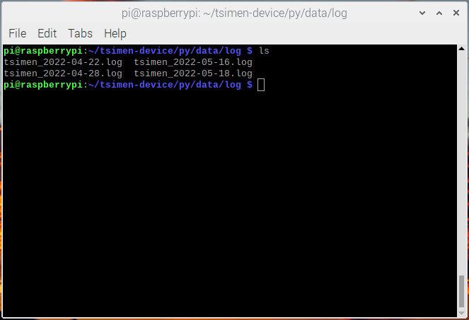

5. 记住最新日期的日志文件，输入：

        #实时查看最新的日志文件
        tail -f 日志文件名

# 
查看上位机（数采仪）程序运行状态

在终端窗口中输入 pgrep python ：如果程序正常运行将显示一串随机整数；否则将  什么都不显示。

        pgrep python

        #显示内容为数字

# 
关闭/开启上位机（数采仪）程序

* 关闭：查看到上位机程序状态后，记住显示的整数串，输入如下指令强制关闭程序：

        sudo kill -9 1225
        #1225 为对应现实的整数串

* 开启：输入如下指令开启程序

        sudo python3 tsimen-device/py/run.py &

# 
使用U盘（移动硬盘）拷贝数据

1、 进入数据文件夹，并查看数据文件夹路径(终端窗口请不要关闭）：

    #进入数据文件夹
    cd tsimen-device/py/data/raw_data/

    #查看数据文件夹的路径
    pwd

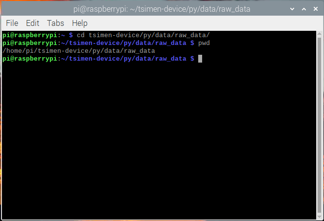

2、 请准备一个U盘，将U盘通过USB口插入树莓派：

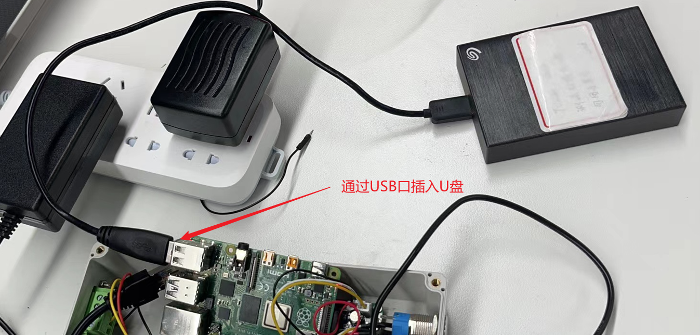

3、 等待半分钟后，重新打开一个新的终端窗口，查看是否接入U盘：

    #进入外设文件夹
    cd /media/pi/
    
    #查看U盘是否接入
    ls

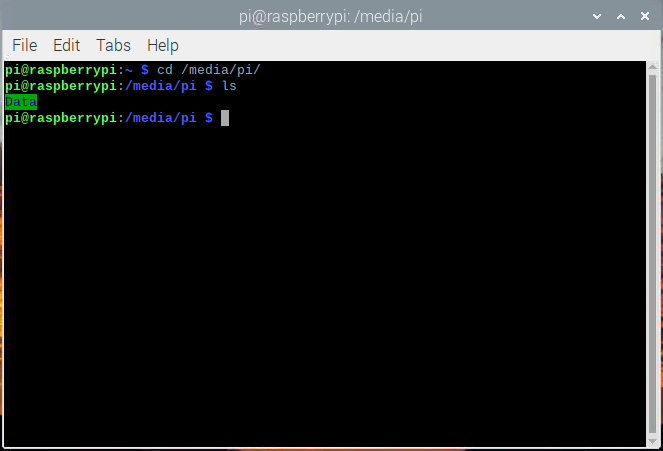

4、 如果没有显示U盘名字，请重复2 3 步骤；如果显示U盘名字，进入U盘后新建一个文件夹，自行重命名(例如：时间-地点-Data，2022-05-18-changqing-Data)

    #进入U盘文件夹
    cd #U盘名字

    #新建文件夹（用于存放拷贝数据）
    mkdir #文件夹名字（例：2022-05-18-changqing-Data）

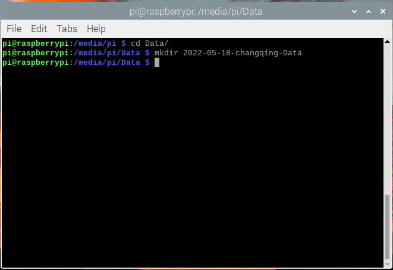

5、 进入新建的文件夹后，将所需要的数据文件拷贝至此文件夹中：(例如：拷贝2022-05-18-17点的所有数据文件)

    #拷贝文件
    cp -r /home/pi/tsimen-device/py/data/raw_data/2022-05-18/raw_2022-05-18-17* ./

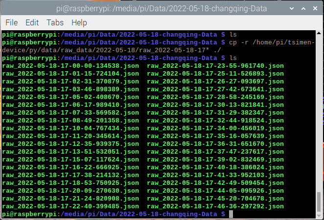

# 
计蒙——数采仪段接线颜色及四根线对应的含义

按照如下图所示接线颜色一一对应即可。

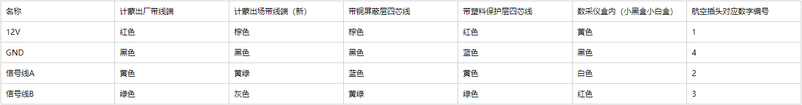

# 
数采仪内部工作指示灯

* RS485模块工作指示灯——共有三个红色指示灯：1 个电源供电指示灯，2 个信号传输指示灯。  
计蒙在正常工作状态下，电源指示灯常亮，两个信号传输指示灯会不间断闪烁。  
如果电源指示灯不亮，电路中其他指示灯正常，说明此485模块损坏。  
如果电源指示灯常亮，两个信号传输指示灯不亮，证明计蒙端没有回传数据，计蒙内部出现异常。

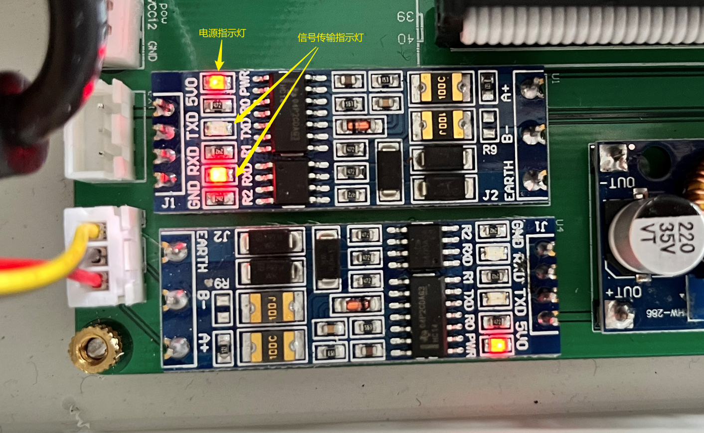

* 树莓派本机工作指示灯——共有一红一绿两个指示灯：红色灯为电源灯，绿色灯为状态指示灯。  
红色灯正常情况下常亮，表示电源正常供电。如果不亮则表明电源供电出现问题（如工作电流太小，USB口挂载大功率设备，树莓派负载功率大等）  
绿色灯正常情况下闪烁，闪烁频率不定，表示正在读取内存卡中内容。如果长时间不闪烁或者上电不闪烁，则可能树莓派系统本身出现问题。

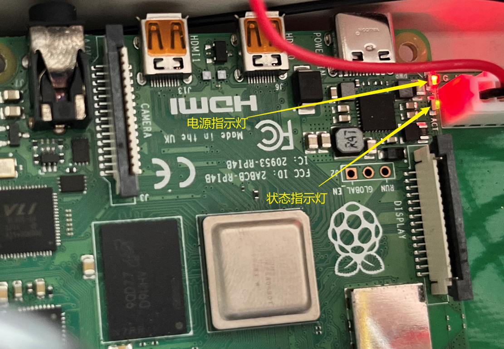

# 
树莓派常用的指令

* ls： 列出当前目录中所有内容（包括文件夹和文件）

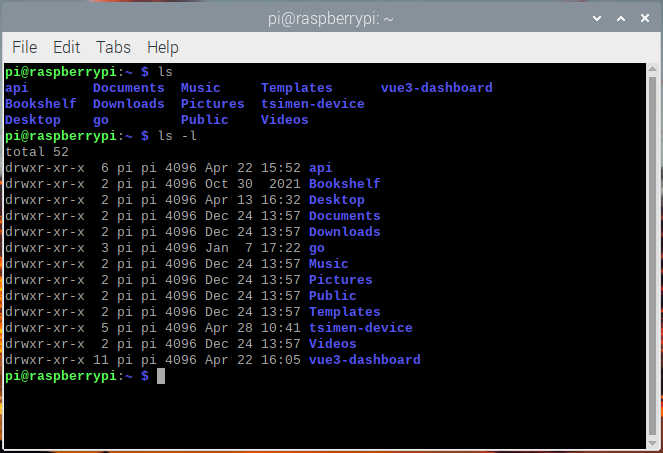

* cd： 跳转至指定目录（更改当前路径至指定目录）

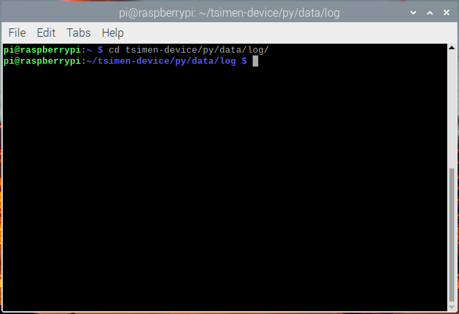

* tail： 查看文件的内容。 使用 tail -f 可以查看正在改变的日志文件（实时查看、实时追踪日志文件）


    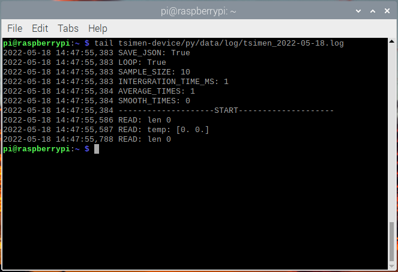
    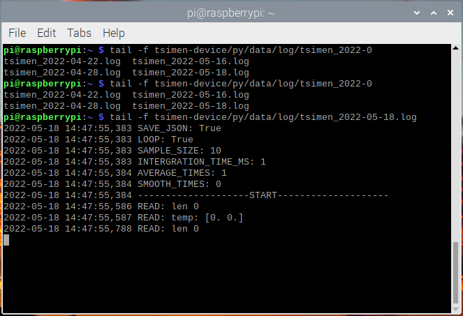


* cp： 复制文件或目录到指定路径

* mkdir： 在当前目录下新建一个文件夹

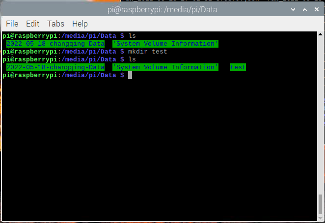

* pwd： 查看当前路径

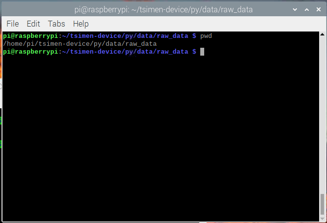

