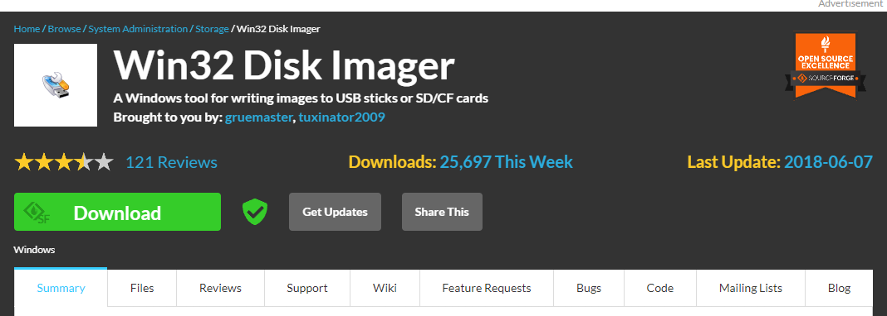

>此文章仅用于 Tsimen1.0 镜像系统以及刷机使用。

# 
镜像 Raspberry 系统

## 一、准备

## 二、

-----
# 
克隆 Raspberry 系统 

用于克隆新的 tf 卡，配置新的上位端树莓派系统。

## 一、准备

我们需要做的准备有：  
* 硬件： TF卡、TF读卡器、树莓派
* 软件： win32磁盘映像工具，diskpart分区查看插件，备份好的镜像系统文件。

## 二、克隆

1、 将镜像系统文件准备至自己的PC电脑。

2、 下载并安装 win32系统映像工具

官方下载网址：https://sourceforge.net/projects/win32diskimager/  

3、 插入搭载 TF内存卡的读卡器，查验内存卡是否为空。如果为空，请直接跳至第4步进行；否则请进行如下清楚操作。

1） 打开cmd命令窗格，输入如下指令。  

    diskpart
    # 回车

2） 在弹出后的diskpart命令窗口中可输入如下指令，  

    list disk                   # 查看目前电脑上的所有磁盘
    select disk 磁盘序号        # 选中对应的磁盘
    list partition              # 查看当前选中磁盘中所有分区
    select partition 分区号     # 选中对应的分区
    delete partition override   #删除选中的分区

<!--  -->

4、 写入镜像系统。打开win32磁盘映像工具，选择对应的镜像系统文件tsimen_pi.img以及对应刷机的 tf 卡，点击写入，等待刷机完成。

<!--  -->

5、 完成后将 tf 卡插入回树莓派中，启动树莓派。

1） 查看树莓派是否正常运行

    cd tsimen-device/py/data/log
    tail -f 最新日志文件名

    cd tsimen-device/py/data/rar_data/最新的时间文件夹
    ls -l

<!--  -->

2） 输入 df -h 查看系统磁盘空间，如果系统磁盘空间偏小，则进行第6步磁盘空间扩容；否则此教程就此结束。

6、 扩容磁盘空间

1） 输入

    sudo raspi-config

2） 在设置界面选择 6 Advanced Options

<!--  -->

3） 进入后选择 A1 Expand Filesystem #回车

<!--  -->

4） 设置完毕后退出设置界面，重启树莓派后检查磁盘空间，此时将恢复至对应 tf 卡的最大容量。
