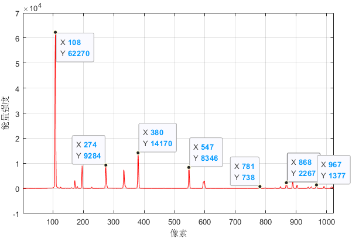
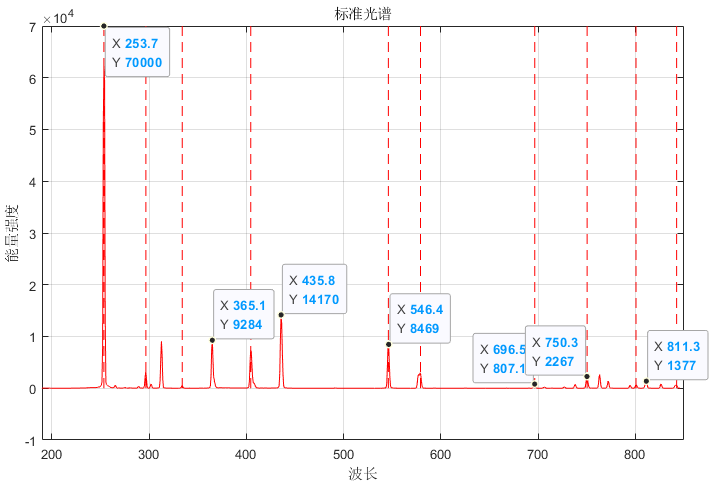
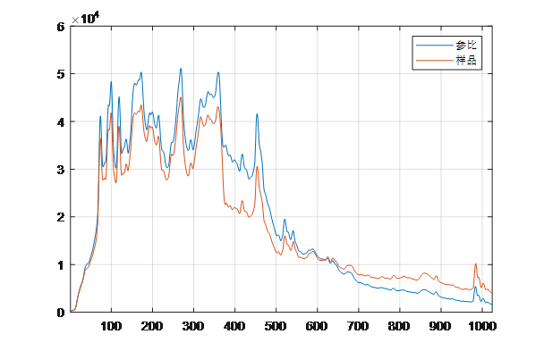
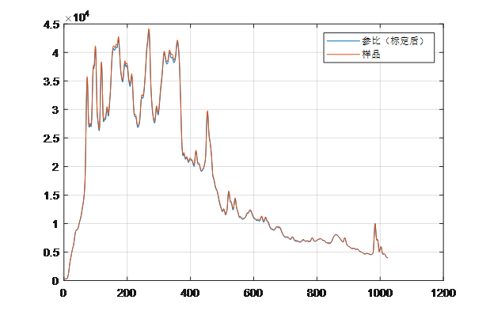

# 
Tsimen2.0 光谱仪波长与能量标定

## 一、波长标定

* 解释： 波长标定用于标定像素值（1~1024）与实际波长值之间的转换关系。

* 像素值： 每台光谱仪的像素值取决于探测器的像素数，目前高利通光谱仪的像素数为 1024。所以像素值从小到大以此为 1,2,3...1024 。

* 波长需要利用标准标定物质（一般为元素灯，如汞氩灯）

波长标定流程如下：

1、 光谱仪直接采集汞氩灯光谱，横坐标为像素值（1~1024），纵坐标为强度值。做寻峰处理，找到波峰所在的像素点。

2、 与汞氩灯的标准光谱进行对比，将像素值与标准波长对应起来。

3、 根据规定的像素与波长之间的关系换算。我们定义像素为X向量，标准波长为Y向量。

X = （108， 274， 380， 547， 781， 868， 967）  
Y = （253.7， 365.1， 435.8， 546.4， 696.5， 750.3， 811.3）

4、 利用5次多项式拟合标定，将 X、Y 带入一下公式：

Y = A5×X5 + A4×X4 + A3×X3 + A2×X2 + A1×X1  + A0

求得 A5 、 A4 、 A3 、 A2 、 A1 、 A0，分别为多项式标定的系数。然后依次算出标定后的 Y 值。

注意：在此我们需要两条指令来获取波长值。1、 读取波长指令，利用标定系数将像素值转换为波长值并输出。2、读取波长标定系数指令，输出标定系数，系数数值类型为Float。数值位数为 16 位字符，常数位为 18 位字符。

## 二、能量标定

* 光路：计蒙产品内部分为两条光路，理论上讲两路的能量应该为一致的，这样才能计算出准确的吸光度。
* 分光：光纤的分光无法保证绝对的5/5分。

* 目的：在假设两路的光强度稳定的情况下，需要利用一元线性方法对两路之间的关系进行标定。

能量标定流程如下：

1、 分别采集两路的能量数据：

2、 在此记参比能量为向量 X ，样品能量为向量 Y，利用一元线性回归公式进行标定：

Y = B1×X + B0

每个波长下均由一组能量标定系数，因此有 1024 组标定系数。

3、 则输出的参比能量为 B1×X + B0 计算过后的参比能量。

注意：在此我们需要一条指令来获取能量标定。1、 读取能量标定参数，按照波长从小到大依次返回标定参数数组。系数数值类型为Float。数值位数为 16 位字符。

